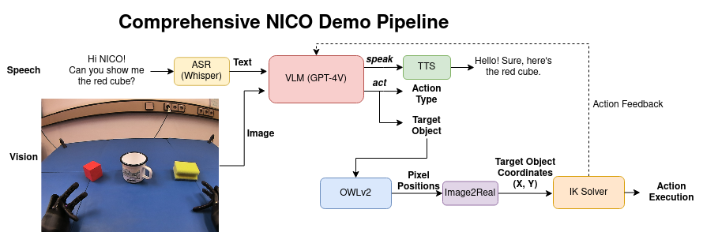

## ELMiRA: Embodying Language Models in Robot Action


### Installation

1. Install [NICO-software](https://github.com/knowledgetechnologyuhh/NICO-software) and place this repository inside `NICO-software/api/src`

2. Download [open_manipulator_msgs](https://github.com/ROBOTIS-GIT/open_manipulator_msgs) and place it inside `NICO-software/api/src`

3. Install required python packages:

    ```bash
    pip install -r ELMiRA/requirements.txt
    ```

4. Rebuild the catkin environment:

    ```bash
    cd .. # NICO-software/api
    catkin_make
    ```

### How to run

1. Run all required ros nodes:

    ```bash
    source activate.bash
    export OPENAI_API_KEY='yourkey'
    roslaunch elmira init_nodes.launch
    ```

2. (optional) run visualization nodes

    #### smach viewer / image publisher
    At the time of writing, the official smach viewer installation is broken, but the image publisher works: 
    ```bash
    source activate.bash
    rosrun smach_viewer smach_image_publisher.py
    ```
    alternatively, you can fix some imports locally and run:
    ```bash
    source activate.bash
    rosrun smach_viewer smach_viewer.py
    ```

    #### rqt_image_view:
    ```bash
    source activate.bash
    rqt_image_view
    ```

    Image topics:
    - `/nico/vision/right`: raw camera image
    - `/owlv2_server/result_image`: camera image with detected bounding boxes and class labels
    - `/smach_image_publisher/image(/compressed)`: image of the state machine with the current state highlighted
    - `/smach_viewer/image`: live image of the smach_viewer gui

3. Run the state machine:

    ```bash
    source activate.bash
    rosrun elmira state_machine.py
    ```

### Citation

@inproceedings{G_a_de_Embodying_Language_Models_2024,author = {G{\"a}de, Connor and {\"O}zdemir, Ozan and Weber, Cornelius and Wermter, Stefan},booktitle = {Proceedings of the 32nd European Symposium on Artificial Neural Networks, Computational Intelligence and Machine Learning (ESANN 2024)},doi = {10.14428/esann/2024.es2024-143},month = oct,pages = {625--630},publisher = {Ciaco - i6doc.com},title = {{Embodying Language Models in Robot Action}},year = {2024}}

```bibtex
@InProceedings{gade2024elmira, 
        author =  {G{\"a}de, Connor and {\"O}zdemir, Ozan and Weber, Cornelius and Wermter, Stefan},  
        title = {Embodying language models in robot action}, 
        booktitle = {Proceedings of the 32nd European Symposium on Artificial Neural Networks, Computational Intelligence and Machine Learning (ESANN 2024)},
        journal = {},
        editors = {},
        number = {},
        volume = {},
        pages = {625--630},
        year = {2024},
        month = {Oct},
        publisher = {Ciaco - i6doc.com},
        doi = {10.14428/esann/2024.es2024-143}, 
     }
```

### License

The website files located in the `/docs` directory are licensed under the Creative Commons Attribution-ShareAlike 4.0 International License. See the `/docs/README.md` for more details.

The rest of this repository is licensed under the GNU General Public License v3.0:

Copyright (C) 2024 Connor Gäde, Ozan Özdemir

This program is free software: you can redistribute it and/or modify
it under the terms of the GNU General Public License as published by
the Free Software Foundation, either version 3 of the License, or
(at your option) any later version.

This program is distributed in the hope that it will be useful,
but WITHOUT ANY WARRANTY; without even the implied warranty of
MERCHANTABILITY or FITNESS FOR A PARTICULAR PURPOSE.  See the
GNU General Public License for more details.

You should have received a copy of the GNU General Public License
along with this program.  If not, see <https://www.gnu.org/licenses/>.
