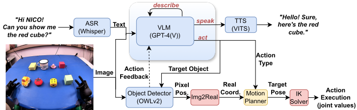

This is the repository for the NICO demo.

### Modular Architecture


### Installation

1. Install `NICO-software` and place this repository inside `NICO-software/api/src`

2. Install required python packages (TODO)

3. Rebuild the catkin environment:

    ```bash
    cd .. # NICO-software/api
    catkin_make
    ```

### How to run the demo

1. Run all required ros nodes:

    #### nico camera:
    ```bash
    source activate.bash
    roslaunch nico_demo camera.launch
    ```

    #### motion + joint controller
    ```bash
    source activate.bash
    roslaunch nicoros joint_controller.launch
    ```

    #### speech asr:
    ```bash
    source activate.bash
    rosrun nico_demo speech_asr.py
    ```

    #### owlv2:
    ```bash
    source activate.bash
    rosrun nico_demo object_localiser.py
    ```

    #### image to real coordinate transfer:
    ```bash
    source activate.bash
    rosrun nico_demo coordinate_transfer.py
    ```

    #### EvoIK:
    ```bash
    source activate.bash
    rosrun nico_demo ik_solver.py
    ```

    #### text to speech:
    ```bash
    source activate.bash
    rosrun nicoros TextToSpeech.py
    ```

    #### gpt 4:
    ```bash
    export OPENAI_API_KEY='yourkey'
    source activate.bash
    rosrun nico_demo llm_api.py
    ```

2. (optional) run visualization nodes

    #### smach image publisher:
    ```bash
    source activate.bash
    rosrun smach_viewer smach_image_publisher.py
    ```

    #### rqt_image_view:
    ```bash
    source activate.bash
    rqt_image_view
    ```

    Image topics:
    - `/nico/vision/right`: raw camera image
    - `/owlv2_server/result_image`: camera image with detected bounding boxes and class labels
    - `/smach_image_publisher/image(/compressed)`: image of the state machine with the current state highlighted

3. Run state machine:

    ```bash
    source activate.bash
    rosrun nico_demo state_machine.py
    ```